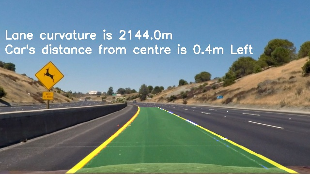

# Advanced Lane Finding for Self-Driving Cars

When humans drive on the road, we rely heavily on lane line-markings to steer our vehicles. The objective of this project is to teach the lane detection ability to a computer as shown in the video below. This project continues upon the work done in the [Basic Lane Finding Project](https://github.com/ssharma1991/autonomous-car-basic-lane-detection) and aims to improve the accuracy and robustness of previous approach.

Images and video files from a dashcam mounted in a car is used as input. Jupyter notebook, Python and OpenCV are used to detect and visualize the lane lines in the input. The anaconda environment being used is available as the [CarND Term1 Starter Kit](https://github.com/udacity/CarND-Term1-Starter-Kit/blob/master/README.md). Clone/download the repo and then:
- rename `meta_windows_patch.yml` to `meta.yml`
- run `conda env create -f environment.yml`
- run `conda update --all`
- run `conda install pywin32`
This successfully sets up the environment on `conda v4.5.12`

## Image Processing Pipeline

To find the lane lines on a road, a pipeline consisting of computer vision techniques in is implemented in `pipeline()` function. The operations are performed in the following sequence:
1. **Input:** An Input image is received by the pipeline. It is be scaled down to 360x640 pixels to standardize size and improve algorithm speed.
2. **Camera Correction:** Camera distortion is an intrinsic property of any image taken by a lens based camera. This distortion is compensated for by a calibration process carried out by `CalibrateCamera()` function which calculates the *Camera Matrix* and the *Distortion Coefficients*. A set of chessboard images is used as input. Then, using the distortion parameters, the undistorted image can be calculated.
3. **Sobel Thresholding:** The Sobel operator with `Kernel size=3` is used to extract gradient information from the dashcam image. A combination of both direction and magnitude based thresholding is done for better lane detection and is implemented in `sobel_thresh()` function.
4. **HLS Augmentation:** Useful lane information can also be extracted using color based thresholding. For this technique, we convert RGB images to HLS images and thresholding the H-channel and S-channel. Use of Adaptive Histogram Equalization helps in gathering relevant lane data. This result is combined with Sobel thresholding in `aug_HLS_thresh()` function to generate the final binary image. This step increases robustness in cases with shadows and variation in road texture. 
5. **Bird's Eye View:** Lane information is easier to process in a birds-eye view of the road. An appropriate prespective transformation is used to convert the binary image into top-down view of the road. Pixel data of reference points in a straight lane are used to create a trapezoid and transform it into a rectangle. `prespective()` function implements this process.
6. **Lane Pixel Detection:** In this step, left and right lane pixels are detected and grouped together. A histogram and tolerance window is used to approximately isolate lane pixels from surrounding noise in the `find_lane_pixels()` function.
7. **Lane Curve Calculation:** Next, a second order quadratic curve is fitted to approximate the lane lines. Lane data is stored as instances of the `line` class. `fit_polynomial_new()` function is used to implement this process.
8. **Inverse Projection:** To visualize the lanes, the detected curves need to be projected back on the image. `invProj()` function accomplishes this.
9. **Lane Parameters Calculation:** Once the lane pixels are calculated, they can be mapped to real environment using standard lane guidlines set by the US Department of Transportation. The curve is used to calculate the curvature of lane and location of car within the lane. `measure_curvature_pixels()` and  `measure_location_in_lane()` functions are used to implement this process. 
10. **Final Visualization:** Finally, the lane data is superimposed with camera view to visualize and debug the workings of the algorithm. Numerical estimation of lane curvature and vehicle position are displayed as text on top of the image. `visualize()` function implements this process.

The image below displays each step in the pipeline.

